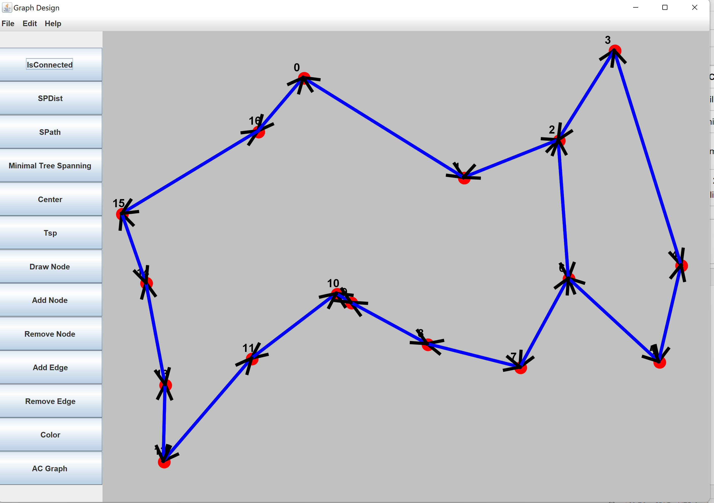
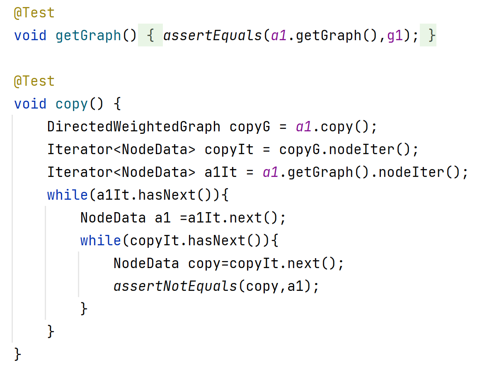
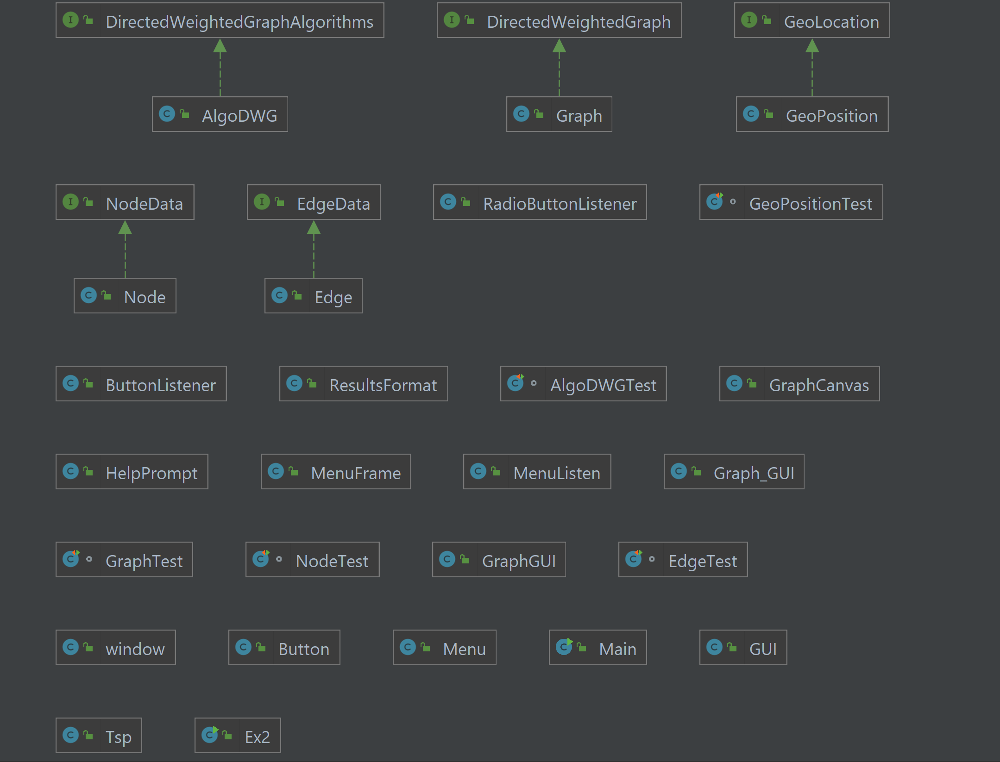

# Graph_design

Graph_design is an software tool for directed and undirected graphs. it gives the user the ability to see the graph
visually, get information about the graph and analyze it. all the information based on many algorithms and calculations
simple and complicated together to give the best complexity possible. Graph design gives Graph_ theory students a new
way to study and understand interacted graphs faster simpler and get productive.

## Technologies

- Intellij idea 2020.2.3
- Junit 5.7
- Jason reader

## Libraries

```java
org.json.simple.JSONArray;
        org.json.simple.JSONObject;
        org.json.simple.parser.JSONParser;
        org.json.simple.parser.ParseExcep
        java.awt.*;
        java.awt.geom.Point2D;
        java.io.FileNotFoundException;
        java.io.FileReader;
        java.io.FileWriter;
        java.io.IOException;
        java.util.*;
        java.util.List;
```

## Structure

Graph design represents each dimension of the graph individually from micro to macro.

#### Geolocation:

***
this is the microest dimension of the graph and it represents a vertex coordinates on the coordinates' system. each
GeoLocatin obj contains x,y,z represent the location as(x,y,z);

#### Node:

***
the class represent each vertex on the graph. all the Nodes in the graph holds their Geolocation, id and, map of
pointers to the Outedges, and other fields for the gui;

#### Edge

***
Edge as it sounds represent the edges of the graph, every edge object contains the src and dest node, weight for
algorithms usage.

#### Graph

***

the macroest dimension of the graph is of course the graph itself, it contains map for the vertexes and the edges.
syncing with the gui the Graph class hold all the functions responsible to the user desires.

#### AlgoDwg

***

this is the core class of Graph design. it contains multiple algorithms based on well known Graph theory algorithms like
Dijkstra DFS and many more, the main method of this class is to disassemble those algorithms to smaller function in way
they can use each other's information and sync with each other, what make Graph Design better quicker and simpler. the
whole class outputs is based on the same results format so each function can help multiple answers for different user
requests. the main algorithms are:

* Sageakstra:
  it based on Dijkstra’s algorithm but uses a better DFS to initialize the vertex weight's use a priority que to make
  sure it always takes the shortest way.

* SagiCp:  
  another greedy based algorithm who use "Tsp" obj to hold a list of node that contains the shortest path between two
  nodes,and a distance represented as double, for each Node we create a Priority que of "Tsp" each one for a
  different  "city", so it "actually" create a new Graph only with the city’s we want to visit while the other Nodes
  connects them are represented in the weight of the shortest distance between them.

* DFS:
  the well known classic DFS algorithm as we used to check connection inside the Graph with deep recursive entree. the
  DFS algorithm gave us a simple structure for other calculations in the project like how we init the weight for each
  Node and in what order of Node we should go first.

## GuiAva

guiAva is our gui for this project, it works on another thread so it communicates with all the other structure without
making the user wait to long, another early thought that made Graph design the best tool for graph theory students.


## investigation

before we started to plan the algorithm the class ant the gui structure we made some internet research about the current
ways to calculate this graph's feature and mathematical proofs the will help us to make simpler calculations with the
best complexity we can.

another thing we did was to module the gui and the calculations together so they will sync with each other and will
shows the results smooth and clean, we made the user interface in a simple good-looking way that every student will fill
comfortable and easy to use. the good communication between those two structure is what makes Graph design so good and
different from other software’s who try's to do the same quests.

## usage

in order to start works with Graph design create a jason file at the source which you installed the software . in the
jason file you need to fill the vertex and the edges by the following format:

```json
{
  "Edges": [
    {
      "src": 0,
      "w": 1.3118716362419698,
      "dest": 16
    }
  ],
  "Nodes": [
    {
      "pos": "35.19589389346247,32.10152879327731,0.0",
      "id": 0
    }
  ]
}
```
# UnitTesting
>A unit test is a way of testing a unit - the smallest piece of code that can be logically isolated in a system. In most programming languages, that is a function, a subroutine, a method or property. ... Modern versions of unit testing can be found in frameworks like JUnit, or testing tools like TestComplete.
once Graph design will detect the file it will lode it and the gui will start with future instructions of how to use, un
any case you get complicated with the gui you can press the "help" Button at the left side of the screen for more
information.
* AlgoDWG
>In testing this unit we would like to check if each of the functions in the above class is indeed working as expected
* Example


### requirements

Graph design works on Windows, linux and mac. it requires a java base ide to run the project. the hardware requirements
are very basic and doe not require highly advance CPU or GPU.

### How to run the app

```bash
# Clone the repository
$ git clone https://github.com/bsharabi/Graph-design.git
# Go into the repository
$ cd Graph-design
# Open the terminal 
$ Run ""java -jar Ex2.jar <data file>"
```

* Example

```bash
# Open the terminal 
$ Run ""java -jar Ex2.jar src/data/G1.json"
```

### Time running

***

| data                   |     ShortestPath    |     IsConnected    |    TSP    |    Center    |
|        :---           |     :---:      |     :---:     |     :---:    |     :---:    |
|         G1 [0-50]           |    1 milliseconds     |       1 milliseconds    |     3 milliseconds    |    2 milliseconds     |
|         G3  [50-100]          |   6 milliseconds     |     6 milliseconds   |    17 milliseconds    |    15 milliseconds    |
|         G4    [100-1000]           |     120 milliseconds     |     125 milliseconds   |    2467 milliseconds    |    120 millisecond    |
|         G5    [1000-10000]        |     2051 milliseconds     |      2034 milliseconds   |     17946 milliseconds    |     2051 milliseconds    |

***

### UML

***


